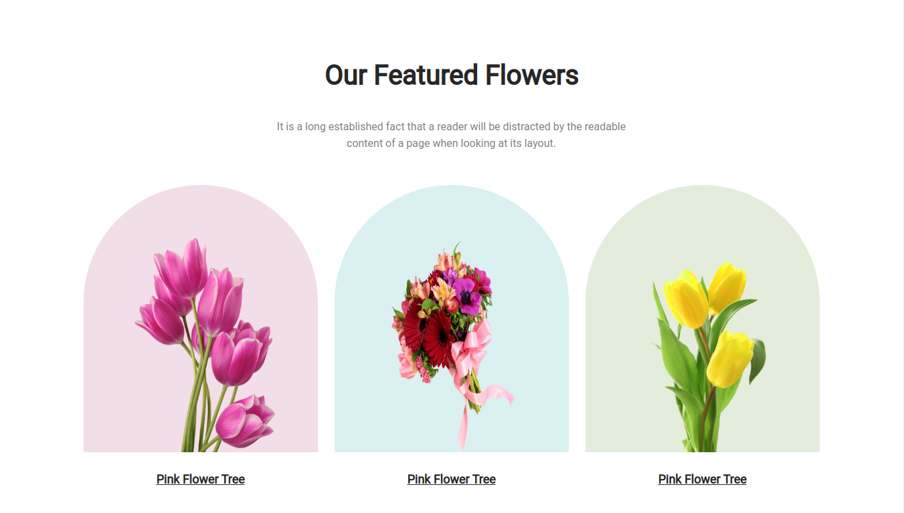

# Project Name : flower-shop

## Project goal

* To build a non-responsive landing page with HTML and CSS for a flower shop for Assignment: 01. 

## Project Description

* A Flower Shop non-responsive landing page website and best fit for the screen size of 1399*768 (16:9) resolution.

## Used technologies

* HTML
* CSS

## Challenges I faced

* Featured section rounded shape and image alignment.

## Things I have learnt

* Css flex box
* Rounded shape card using border radius (top left + top right corner)

### Live Website link [https://zahid-bm.github.io/flower-shop/] 
